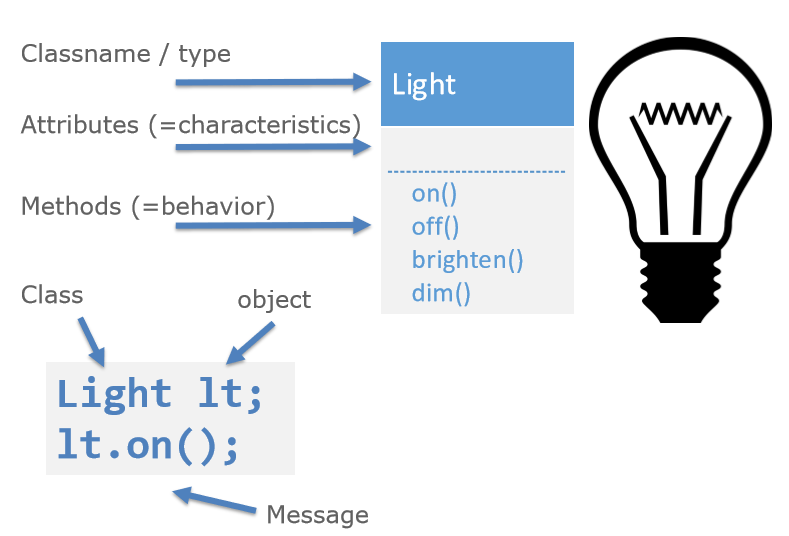
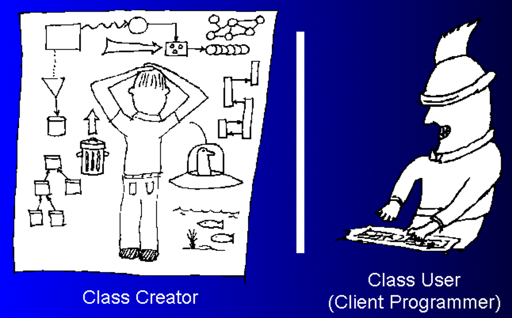
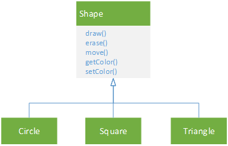
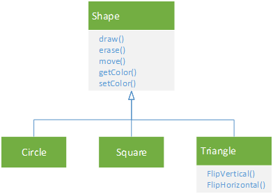
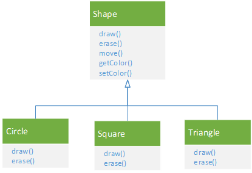
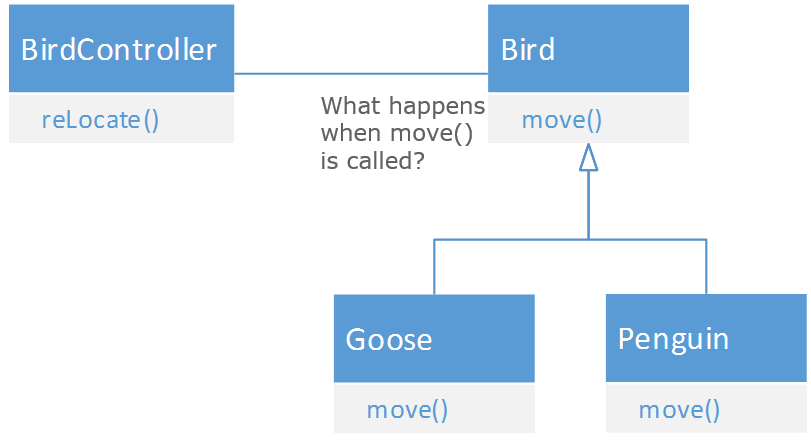
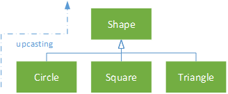

# The Progress of Abstraction

All programming languages provide abstractions. The complexity of the problem you want to solve is directly related to the kind and quality of abstraction.

> Complexity &lt;-&gt; Abstraction

Assembly is an abstraction for machine code. Imperative languages \(Fortran, Basic and C\) are abstractions of assembly languages. These languages are a big improvement BUT ! Still requires you to think in terms of the structure of the computer rather than the structure of the problem.

The programmer must establish the association between:

1. the machine model: “_solution space_”, the place where the problem must be solved
2. the model of the problem of the problem: “_problem space_”, the place where the problem exists

In this case we are modeling the machine to solve our problems. Using programming languages such as assembler, Fortran, Basic or C

The alternative to modeling the machine is to model the problem you are trying to solve. This was introduced by languages such as:

* LISP: All problems are ultimately lists
* APL: All problems are algorithmic
* Prolog: All problems are chains of decisions

A good solution to a particular class of problems, but becomes awkward when you step outside the domain.

The object-oriented approach goes a step farther. It provides tools to represent the elements in the problem space. The representation is general enough so that it is not constrained to any particular type of problem. Elements in the problem space are represented in the solution space as “_objects_”.

There is still a connection to back to the computer. Each object looks a bit like a little computer.

* has state
* has operations

This is in analogy with the real world. Everything has characteristics and behaviour.

Five basic characteristics of Smalltalk, the first successful object-oriented language. One of the languages upon which C++ is bases. They represent a pure approach to object-oriented programming.

1. Everything is an object
2. A program is a bunch of objects telling each other what to do by sending messages
3. Each object has its own memory made up of other objects
4. Every object has a type
5. All objects of a particular type can receive the same message

#### Everything is an object

Think of an object as a fancy variable. It stores data and you can make requests to the object. In theory, any conceptual component in the problem \(dogs, buildings, services, etc…\) can be represented as an object in the program.

#### A program is a bunch of objects telling each other what to do by sending messages

To make a request of an object, you “send a message” to that object. A message is an request to call a function that belongs to that object

#### Each object has its own memory made up of other objects

You can create a new kind of object by making a package containing existing objects. Thus you can build complexity in a program while hiding it behind the simplicity of objects.

#### Every object has a type

Each object is an “_instance_” of a “_class_”. Class is synonymous with “_type_”.

The most important distinguishing characteristic of a class is:

> What messages can you send to it?

#### All objects of a particular type can receive the same message

Eg: an object of type “circle” is also an object of type “shape”.

A circle is guaranteed to accept shape messages. This means you can talk to shapes, and automatically handle anything that fits the description of a shape.

This substitutability is one of the most powerful concepts in OOP.

## An Object has an Interface

Aristotle was one of the first to study the concept of “type”. He spoke of ‘the class of fishes and the class of birds’. The idea that all objects, while being unique, are part of a class of objects. Objects that have the same characteristics and behaviors.

The keyword “_class_” was first introduced in the language Simula-67 to introduce a new type into a program. Objects are identical except for their state. When a class is established, you can make as many objects of that type as you like. Each with their own state and identity.

The interface establishes what request you can make. There must be code somewhere to satisfy that request, Along with the hidden data, it comprises the implementation. It is not that complicated. A type has a function associated with each possible request. When you make a request to that object, a function is called.

Summarized: You ‘send a message’ to an object. The object figures out what to do \(it executes code\).



## The Hidden Implementation

We can break up the playing field into:

* Class creators, those who create new data types
* Client programmers, the class consumers

Client programmers: Collect a toolbox full of classes to user for rapid application development.

Class creators: Build a class that exposes only what’s necessary to the client programmer and keeps everything else hidden

### Why hiding?

If it’s hidden, the client programmer cant use it. That means that the class creator can change the hidden portion at will, without worrying about the impact to anyone else. In any relationship it is important to have boundaries that are respected by all parties involved.

When creating a library, you establish a relationship with the client programmer. If all member are available to anyone, the client programmer can do what ever he want’s and there is no way of enforcing the rules. If you don’t want this, there is no way to prevent it.

Access control prevents client programmers to hands off portions they shouldn’t touch. Hiding the internals that are not part of the interface that users need, is actually a service to the users. Client programmers can easily see what’s important for them and ignore the rest. C++ uses keywords \(access modifiers\) to set those boundaries in a class `public`, `private` and `protected`.



Once a class is created and tested, it should ideally represent a useful unit of code. Code reuse is one of the greatest advantages of object-oriented programming languages. DRY anyone?! Multiple ways to reuse a class:

* Just use an object of that class
* Composition: Use an object of that class inside a new class
* Inheritance: Extending the class in a new class

### Just using an object

The class can be reused by creating multiple objects of that class Each object has its own state Each object has the same behavior

### Composition

Use an object of that class inside a new class. This is also known as a _Has-a_ relationship, eg: ‘a car has an engine’.


This is called composition because you are composing a new class out of existing classes. This is more generally known as _aggregation_. It comes with a great deal of flexibility. Member objects of the new class can be made private. They are inaccessible to client programmers. You can change those members without disturbing existing client code.

### Inheritance


The concept of an object is a convenient tool. You can package data and functionality together by concept. Inheritance lets you reuse classes in new classes that might have a similar functionality. We could say that we clone a class and then make additions and modifications to it. If the original class \(base, super or parent class\) is changed, the modified ‘_clone_’ also reflects those changes.



The base type is “shape”. All shapes have a size, color, position,… All shapes can be drawn, erased, moved, colored,… Specific shapes derive \(inherit\) these characteristics and behavior Circle, square, triangle Each may have additional characteristics and behavior. Eg: some shapes can be flipped. Some behaviors may be different like calculating the area of a shape depends on the type of shape.

## Interchangable Objects with Polymorphism

When inheriting from an existing shape, you create a new type. The new type contains not only all the member of the existing types \(Although the private ones are hidden and inaccessible\). More importantly, it duplicates the interface of the base class. All messages, send to the base class, can be send to the derived class. This means that the derived class is the same type as the base class.

Type equivalence via inheritance is one of the fundamental gateways in understanding the meaning of object-oriented programming.



You can add new functions to the derived class. Add functionality that the base class cannot do. You create a new interface that is different from the base class.



You can change existing behavior that is different from that of the base class. This is also known as _overriding_ a function. You simply create a new definition for the function in the derived class.

When working with type hierarchies:

* The object is often treated not as the specific type, but as its base type
* This allows for code that does not depend on specific types
* Such code is unaffected by the addition of new types
* There is a problem with attempting to treat derived-type objects as their generic base type. The compiler cannot know at compile-type precisely what piece of code will be executed \(this is just the point\).



The compiler cannot make a function call in the traditional way.What move function to call? Normally a function call generated by the compiler causes what is called early binding. The compiler generates a call to a specific name and the linker resolves the call to an absolute address of the code. The problem is solved with the concept of _late binding_. Code to call is not being determined until runtime. The compiler does ensure that the function exist and performs type checking on the arguments and return value.

To perform late binding, the C++ compiler inserts special code instead of the absolute call. The code calculates the address of the function body. Using information stored in the object. The programmer must state that he wants the flexibility of late binding properties by using the keyword virtual. By default all functions are not dynamically bound.

The virtual keyword is needed to have polymorphic behavior. The virtual keyword enabled the late binding functionality.

```c
void doSomething(Shape& s){
  s.draw( );
  //. . .
  s.erase( );
}
```

Decouple the code by writing against the base class. You do not need the details of the inherited class. The code becomes more simple.

You can use what ever shape you want when calling the doSomething\(\) method. You can use an new type such as a Hexagon.

```c
Circle aCircle;
Line aLine;
doSomething( aCircle );  // Dynamic Binding
doSomething( aLine );    // aka Late Binding
```

The process of treating a derived class as it were its base class is called _upcasting_. The program is extensible. It can work with more types than those already existing.



## Creating and destroying objects

Technically the domain of OOP is abstract data typing, inheritance and polymorphism. Other issues can be at least important. Such as the way objects are created and destroyed. Where is the data for an object. How is the lifetime of that object controlled? C++ takes the approach that control of efficiency is the most important. It gives the programmer a choice. The storage and lifetime can be determined while implementing the program Objects can be placed on the stack, or in static storage.

### Stack

The stack is an area in memory that is directly used by the microprocessor to store data during program execution. Variables on the stack are sometimes called automatic or scoped variables. A fixed patch of memory that is allocated before the program begins to run. It places the priority on the speed of storage allocation and sacrifice flexibility. You must exactly know the quantity, lifetime and type of object while you write the program.

### Heap

The alternative is to create objects dynamically. A pool of memory called the heap is used for this. Advantage is you don’t have t know how many object, their lifetime or exact type until runtime. The decisions are can be made while the program is running. If you need a new object, simply create it on the heap using the `new` keyword. When finished you must release it with the `delete` keyword. Because storage is managed at runtime, the dynamic allocation is many times slower compared to stack allocation.

### Garbage Collector

The compiler has no knowledge of the lifetime of dynamically created objects. The programmer must determine programmatically when to destroy the object by using the delete keyword. An alternative is the garbage collector. It automatically discovers when objects are no longer in use and destroys it. It makes writing programs much more convenient, but all applications must be able to tolerate the existence of the garbage collector and the overhead coming along with it. This does not meet the design requirements of the C++ language so a garbage collector not is included!

Third-party garbage collectors exist for C++ if needed.

## Exception Handling

Error handling is a difficult issue ever since the beginning of programming. It is hard to design a good error-handling scheme. Many language simply ignore it for that reason Exception handling wires error handling directly into the programming language. An exception is an object that is “thrown” from the origin of the error and can be “caught” by an appropriate exception handler. It has some kind of parallel path of execution. This prevents interfering with the normal path of execution. It makes code easier to write.

## Why C++ succeeds

A better C Syntax already known Efficiency \(Complex\) systems are easier to express and understand Maximum leverage with libraries Source-code reuse with templates Error handling Programming in the large

## Summary

Give a feel for the broad issues of object-oriented programming and C++ Why OOP is different Concepts of OOP methodologies OOP may nog be for everyone Good OOP code is much more easier than procedural code \(data definitions and function calls\) Procedural code: solving problems in the solution space \(computer oriented\) OOP: solving problems in the problem space \(problem oriented\) Programs are a bunch of objects that send messages to each other

