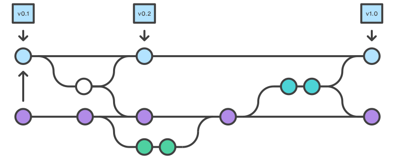
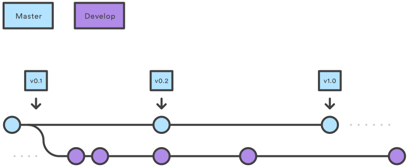
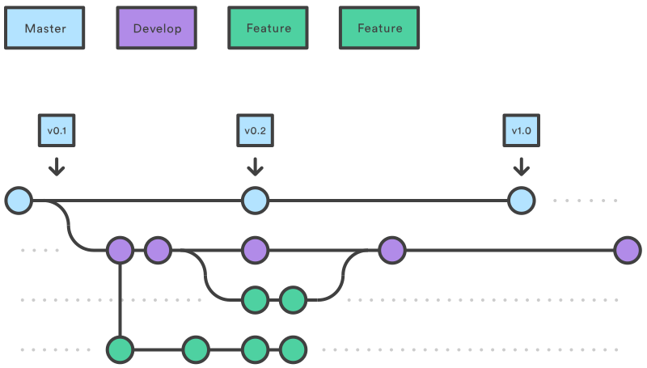
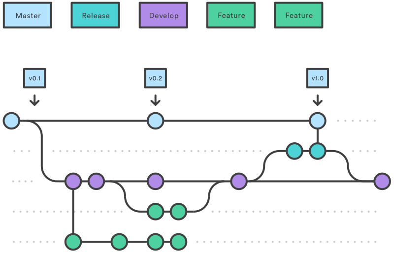
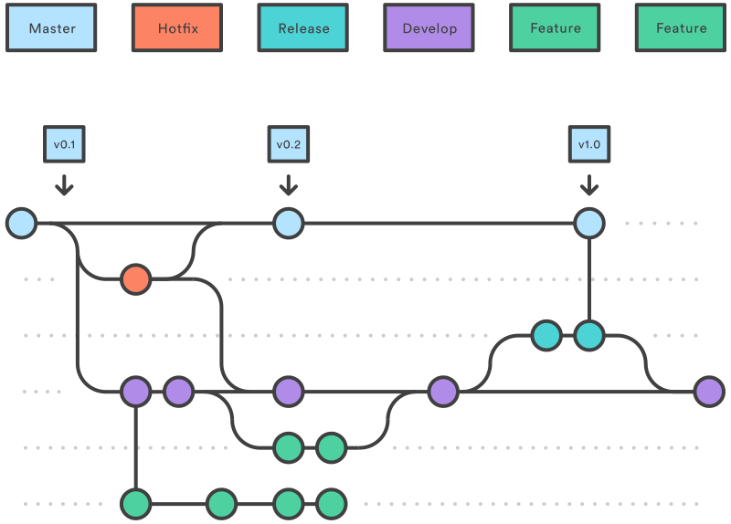

# Gitflow Workflow



The Gitflow Workflow section below is derived from Vincent Driessen at nvie.

The Gitflow Workflow defines a strict branching model designed around the project release. While somewhat more complicated than the Feature Branch Workflow, this provides a robust framework for managing larger projects.

This workflow doesn’t add any new concepts or commands beyond what’s required for the Feature Branch Workflow. Instead, it assigns very specific roles to different branches and defines how and when they should interact. In addition to feature branches, it uses individual branches for preparing, maintaining, and recording releases. Of course, you also get to leverage all the benefits of the Feature Branch Workflow: pull requests, isolated experiments, and more efficient collaboration.

## How It Works

The Gitflow Workflow still uses a central repository as the communication hub for all developers. And, as in the other workflows, developers work locally and push branches to the central repo. The only difference is the branch structure of the project.

### Historical Branches

Instead of a single `master` branch, this workflow uses two branches to record the history of the project. The `master` branch stores the official release history, and the `develop` branch serves as an integration branch for features. It's also convenient to tag all commits in the `master` branch with a version number.



The rest of this workflow revolves around the distinction between these two branches.

### Feature Branches

Each new feature should reside in its own branch, which can be pushed to the central repository for backup/collaboration. But, instead of branching off of `master`, feature branches use develop as their parent branch. When a feature is complete, it gets merged back into `develop`. Features should never interact directly with `master`.



Note that feature branches combined with the `develop` branch is, for all intents and purposes, the Feature Branch Workflow. But, the Gitflow Workflow doesn’t stop there.

### Release Branches



Once `develop` has acquired enough features for a release (or a predetermined release date is approaching), you fork a release branch off of `develop`. Creating this branch starts the next release cycle, so no new features can be added after this point—only bug fixes, documentation generation, and other release-oriented tasks should go in this branch. Once it's ready to ship, the release gets merged into `master` and tagged with a version number. In addition, it should be merged back into `develop`, which may have progressed since the release was initiated.

Using a dedicated branch to prepare releases makes it possible for one team to polish the current release while another team continues working on features for the next release. It also creates well-defined phases of development (e.g., it's easy to say, “this week we're preparing for version 4.0” and to actually see it in the structure of the repository).

Common conventions:

* branch off: develop
* merge into: master
* naming convention: release-* or release/*

### Maintenance Branches



Maintenance or “hotfix” branches are used to quickly patch production releases. This is the only branch that should fork directly off of `master`. As soon as the fix is complete, it should be merged into both `master` and `develop` (or the current release branch), and `master` should be tagged with an updated version number.

Having a dedicated line of development for bug fixes lets your team address issues without interrupting the rest of the workflow or waiting for the next release cycle. You can think of maintenance branches as ad hoc release branches that work directly with `master`.

## Example

The example below demonstrates how this workflow can be used to manage a single release cycle. We’ll assume you have already created a central repository.

### Create a develop branch


he first step is to complement the default `master` with a develop branch. A simple way to do this is for one developer to create an empty `develop` branch locally and push it to the server:

```
git branch develop
git push -u origin develop
```

This branch will contain the complete history of the project, whereas `master` will contain an abridged version. Other developers should now clone the central repository and create a tracking branch for develop:

```
git clone ssh://user@host/path/to/repo.git
git checkout -b develop origin/develop
```

Everybody now has a local copy of the historical branches set up.

### Mary and John begin new features


Our example starts with John and Mary working on separate features. They both need to create separate branches for their respective features. Instead of basing it on `master`, they should both base their feature branches on `develop`:

```
git checkout -b some-feature develop
```

Both of them add commits to the feature branch in the usual fashion: edit, stage, commit:

```
git status
git add <some-file>
git commit
```

### Mary finishes her feature


After adding a few commits, Mary decides her feature is ready. If her team is using pull requests, this would be an appropriate time to open one asking to merge her feature into `develop`. Otherwise, she can merge it into her local `develop` and push it to the central repository, like so:

```
git pull origin develop
git checkout develop
git merge some-feature
git push
git branch -d some-feature
```

The first command makes sure the `develop` branch is up to date before trying to merge in the feature. Note that features should never be merged directly into `master`. Conflicts can be resolved in the same way as in the Centralized Workflow.

### Mary begins to prepare a release


While John is still working on his feature, Mary starts to prepare the first official release of the project. Like feature development, she uses a new branch to encapsulate the release preparations. This step is also where the release’s version number is established:

```
git checkout -b release-0.1 develop
```

This branch is a place to clean up the release, test everything, update the documentation, and do any other kind of preparation for the upcoming release. It’s like a feature branch dedicated to polishing the release.

As soon as Mary creates this branch and pushes it to the central repository, the release is feature-frozen. Any functionality that isn’t already in `develop` is postponed until the next release cycle.

### Mary finishes the release


Once the release is ready to ship, Mary merges it into `master` and `develop`, then deletes the release branch. It’s important to merge back into `develop` because critical updates may have been added to the release branch and they need to be accessible to new features. Again, if Mary’s organization stresses code review, this would be an ideal place for a pull request.

```
git checkout master
git merge release-0.1
git push
git checkout develop
git merge release-0.1
git push
git branch -d release-0.1
```

Release branches act as a buffer between feature development (`develop`) and public releases (`master`). Whenever you merge something into `master`, you should tag the commit for easy reference:

```
git tag -a 0.1 -m "Initial public release" master
git push --tags
```

Git comes with several hooks, which are scripts that execute whenever a particular event occurs within a repository. It’s possible to configure a hook to automatically build a public release whenever you push the `master` branch to the central repository or push a tag.

### End-user discovers a bug


After shipping the release, Mary goes back to developing features for the next release with John. That is, until an end-user opens a ticket complaining about a bug in the current release. To address the bug, Mary (or John) creates a maintenance branch off of `master`, fixes the issue with as many commits as necessary, then merges it directly back into `master`.

```
git checkout -b issue-#001 master
# Fix the bug
git checkout master
git merge issue-#001
git push
```

Like release branches, maintenance branches contain important updates that need to be included in `develop`, so Mary needs to perform that merge as well. Then, she’s free to delete the branch:

```
git checkout develop
git merge issue-#001
git push
git branch -d issue-#001
```

## Where To Go From Here

By now, you’re hopefully quite comfortable with the Centralized Workflow, the Feature Branch Workflow, and the Gitflow Workflow. You should also have a solid grasp on the potential of local repositories, the push/pull pattern, and Git's robust branching and merging model.

Remember that the workflows presented here are merely examples of what’s possible—they are not hard-and-fast rules for using Git in the workplace. So, don't be afraid to adopt some aspects of a workflow and disregard others. The goal should always be to make Git work for you, not the other way around.

<iframe width="800" height="480" src="https://www.youtube.com/embed/q3gwZ3Q-s2s" frameborder="0" allow="accelerometer; autoplay; encrypted-media; gyroscope; picture-in-picture" allowfullscreen></iframe>
