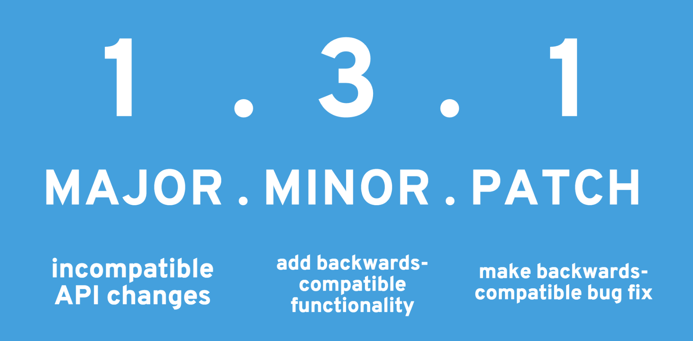

# SemVer - Semantic Versioning

Given a version number `MAJOR.MINOR.PATCH`, increment the:

1. MAJOR version when you make incompatible API changes,
1. MINOR version when you add functionality in a backwards compatible manner, and
1. PATCH version when you make backwards compatible bug fixes.

Additional labels for pre-release and build metadata are available as extensions to the MAJOR.MINOR.PATCH format.

## Introduction

In the world of software management there exists a dreaded place called “dependency hell.” The bigger your system grows and the more packages you integrate into your software, the more likely you are to find yourself, one day, in this pit of despair.

In systems with many dependencies, releasing new package versions can quickly become a nightmare. If the dependency specifications are too tight, you are in danger of version lock (the inability to upgrade a package without having to release new versions of every dependent package). If dependencies are specified too loosely, you will inevitably be bitten by version promiscuity (assuming compatibility with more future versions than is reasonable). Dependency hell is where you are when version lock and/or version promiscuity prevent you from easily and safely moving your project forward.

As a solution to this problem, I propose a simple set of rules and requirements that dictate how version numbers are assigned and incremented. These rules are based on but not necessarily limited to pre-existing widespread common practices in use in both closed and open-source software. For this system to work, you first need to declare a public API. This may consist of documentation or be enforced by the code itself. Regardless, it is important that this API be clear and precise. Once you identify your public API, you communicate changes to it with specific increments to your version number. Consider a version format of X.Y.Z (Major.Minor.Patch). Bug fixes not affecting the API increment the patch version, backwards compatible API additions/changes increment the minor version, and backwards incompatible API changes increment the major version.

I call this system “Semantic Versioning.” Under this scheme, version numbers and the way they change convey meaning about the underlying code and what has been modified from one version to the next.