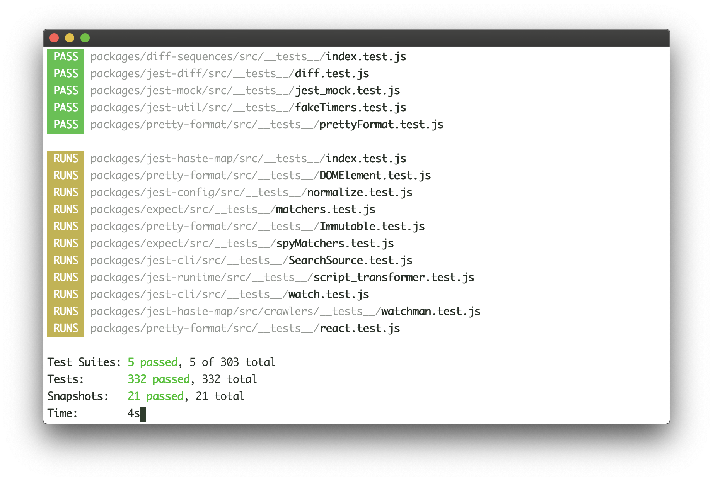
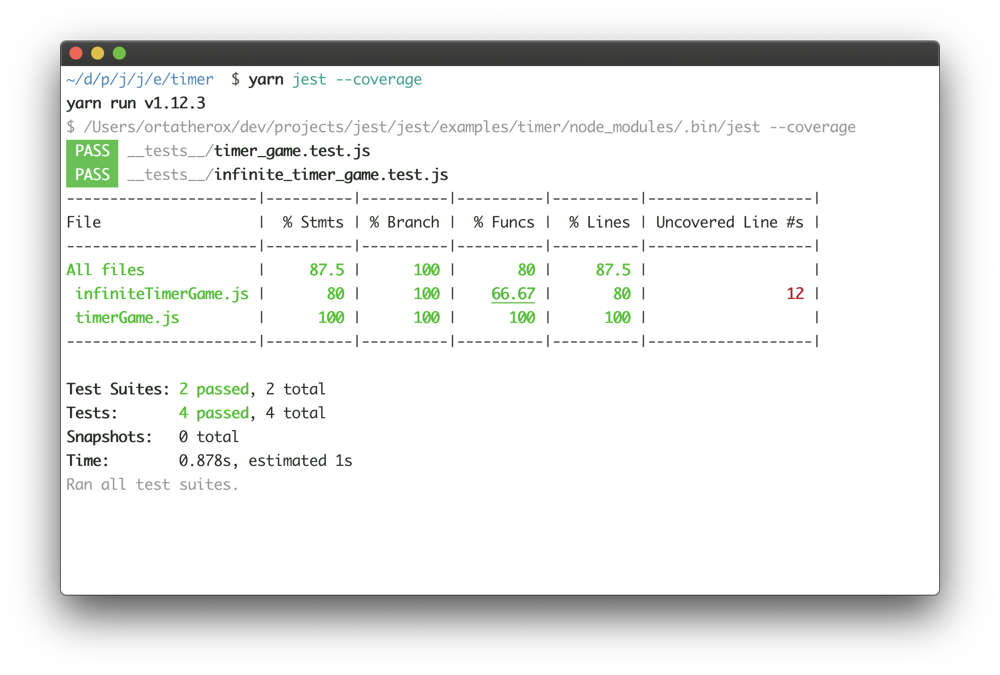
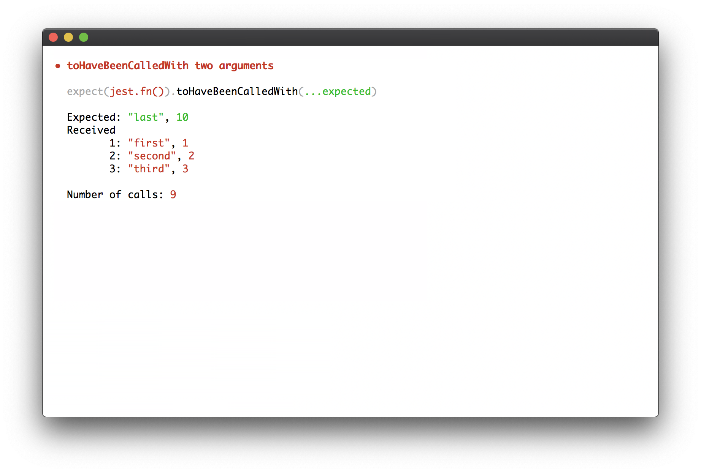
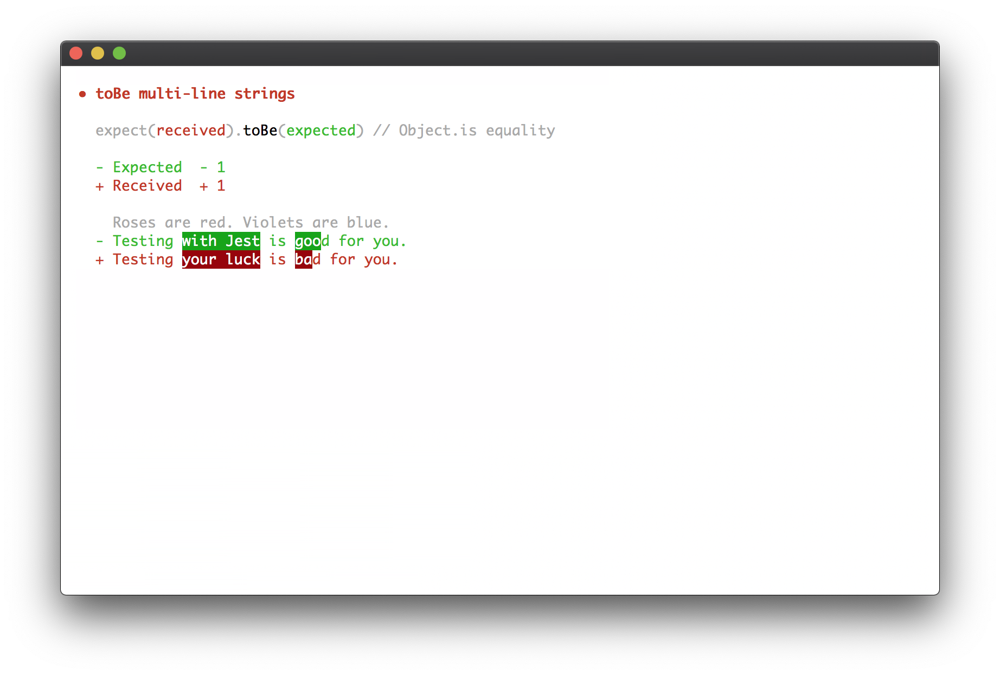

<!-- markdownlint-disable MD0033 -->

# Testing TypeScript with Jest

[https://jestjs.io/en/](https://jestjs.io/en/)

## Jest Testing Framework

Jest is a delightful JavaScript Testing Framework with a focus on simplicity.

* **Zero config**: Jest aims to work out of the box, config free, on most JavaScript projects.
* **Snapshots**: Make tests which keep track of large objects with ease. Snapshots live either alongside your tests, or embedded inline.
* **Isolated**: Tests are parallelized by running them in their own processes to maximize performance.
* **Great api**: From it to expect - Jest has the entire toolkit in one place. Well documented, well maintained, well good.

### Fast and safe



By ensuring your tests have unique global state, Jest can reliably run tests in parallel. To make things quick, Jest runs previously failed tests first and re-organizes runs based on how long test files take.

### Code coverage



Generate code coverage by adding the flag --coverage. No additional setup needed. Jest can collect code coverage information from entire projects, including untested files.

### Easy Mocking



Jest uses a custom resolver for imports in your tests making it simple to mock any object outside of your test’s scope. You can use mocked imports with the rich Mock Functions API to spy on function calls with readable test syntax.

### Great Exceptions



Tests fail—when they do, Jest provides rich context why. Here are some examples:

* `toBe`
* `toBeCloseTo`
* `toEqual`
* `toStrictEqual`
* `toHaveProperty`
* `toMatchSnapshot`
* `toThrowError`
* ...

### Philosophy

Jest is a JavaScript testing framework designed to ensure correctness of any JavaScript codebase. It allows you to write tests with an approachable, familiar and feature-rich API that gives you results quickly.

Jest is well-documented, requires little configuration and can be extended to match your requirements.

Jest makes testing delightful.

\- Jest Core Team

## Setup

Install dependencies

```shell
npm install --save-dev @types/jest jest ts-jest
```

In your `package.json` add the following scripts to make it easy to use Jest:

```json
  "scripts": {
    "test": "jest",
    "test:watch": "jest --coverage --watchAll",
    "coverage": "jest --coverage",
  },
```

This will add a script to run the tests, and a script to check the test coverage.

Create `jest.config.js` in the root of your project (where your `package.json`
file lives)

```javascript
module.exports = {
  transform: {'^.+\\.ts?$': 'ts-jest'},
  testEnvironment: 'node',
  testRegex: '/tests/.*\\.(test|spec)?\\.(ts|tsx)$',
  moduleFileExtensions: ['ts', 'tsx', 'js', 'jsx', 'json', 'node']
}
```

This configuration file will add support for TypeScript to Jest using ts-jest.

Next we need to ignore tests when building our project using the TypeScript Compiler.

You can do this in your `.tsconfig.json` file. Your configuration should look something
like this:

```json
{
  "compilerOptions": {
    "target": "es5",
    "module": "commonjs",
    "lib": ["es2015"],
    "strict": true,
    "declaration": true,
    "outDir": "dist",
    "sourceMap": true
  },
  "include": ["src/**/*"],
  "exclude": ["node_modules", "**/*.test.ts"]
}
```

Note the `exclude` settings will ignore tests files in the compiled result.

## A Directory for your Tests

Its best to separate tests files from your source files. The best options is to
create a `tests` directory in the root of your project. This directory will contain
all tests for the whole project.

If you would like to create some tests for code that lives in `src/foo/bar.ts` then
you just create a `tests/foo/bar.test.ts` file. The directory structure and filenames
should match your source file. The only difference is the root directory is called
`tests` instead of `src`, and the filename has an extra `.test.ts` extension instead
of the normal `ts`.

This organization of test files will make it easy to understand what is being tested
and will make it a no brainer on where the test for a particular file could be found
and vica versa.

## Creating a Test

Consider that we have a class defined in `scr/sum.ts` containing the code:

```ts
export default function sum(a: number, b: number): number {
  return a + b;
}
```

Then you can create a test that will verify the functionality in a file called
`tests/sum.test.ts`:

```ts
import sum from '../src/sum'

test('adds 1 + 2 to equal 3', () => {
  expect(sum(1, 2)).toBe(3);
});
```

The most important parts of this file are:

1) A `test()` method containing a description of the test and a function to execute
the test.
2) An `expect()` method that will actually run the code to be tested
3) A `toBe()` method that will check if the result equals a specific value. If this
is true, the test succeeds. If this is false, the test will fail.

## Running the Tests

Running the tests is as easy:

```shell
npm run test
```

or you could even use

```shell
npm test
```

This will generate a report that will look something like this:

```shell
PASS  ./sum.test.js
✓ adds 1 + 2 to equal 3 (5ms)
```

### Running Test Automatically

Tests can be ran automatically, showing results directly after you save your changes.
This results in a very fast feedback loop. Just use the following command:

```shell
npm run test:watch
```

This will run the tests and will keep watching your files for any changes. When a
file changes, the test will run again automatically.

## Running Coverage Report

Jest enables you to get a report of test coverage. This means it will show you
what code is actually being tested, and which code is not. This is a helpful tool
to get feedback on how much you are actually testing, and what you might forget to
cover in your tests.

## More resources

More information on how to use Jest can be found at its documentation website.
Some important pointer are:

<iframe width="560" height="315" src="https://www.youtube.com/embed/FgnxcUQ5vho" frameborder="0" allow="accelerometer; autoplay; encrypted-media; gyroscope; picture-in-picture" allowfullscreen></iframe>

<iframe width="560" height="315" src="https://www.youtube.com/embed/7r4xVDI2vho" frameborder="0" allow="accelerometer; autoplay; encrypted-media; gyroscope; picture-in-picture" allowfullscreen></iframe>

* [Using Matchers](https://jestjs.io/docs/en/using-matchers)
* [Expect](https://jestjs.io/docs/en/expect)
* [Testing Asynchronous code](https://jestjs.io/docs/en/asynchronous)
* [Setup and Teardown](https://jestjs.io/docs/en/setup-teardown)